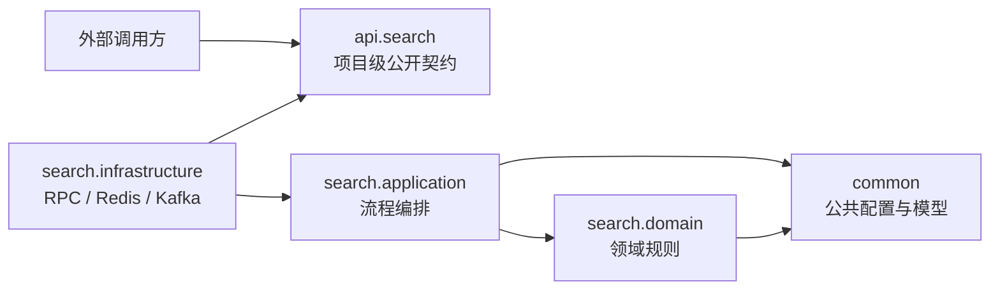
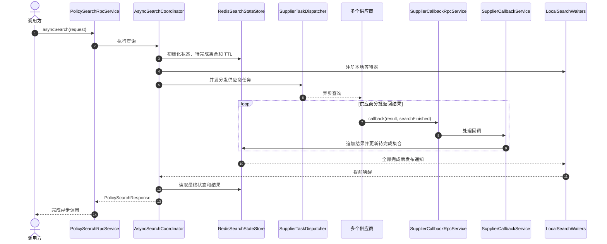
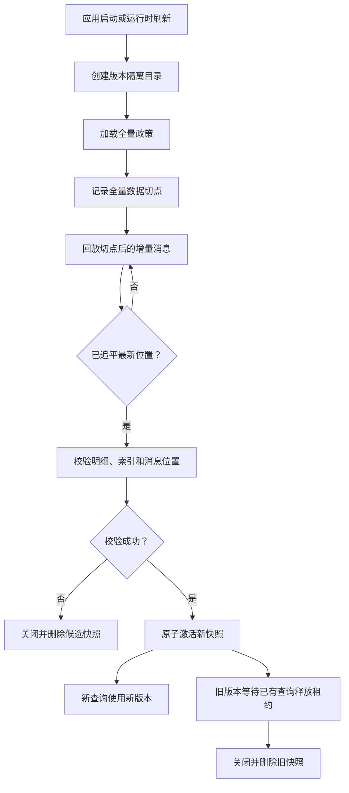
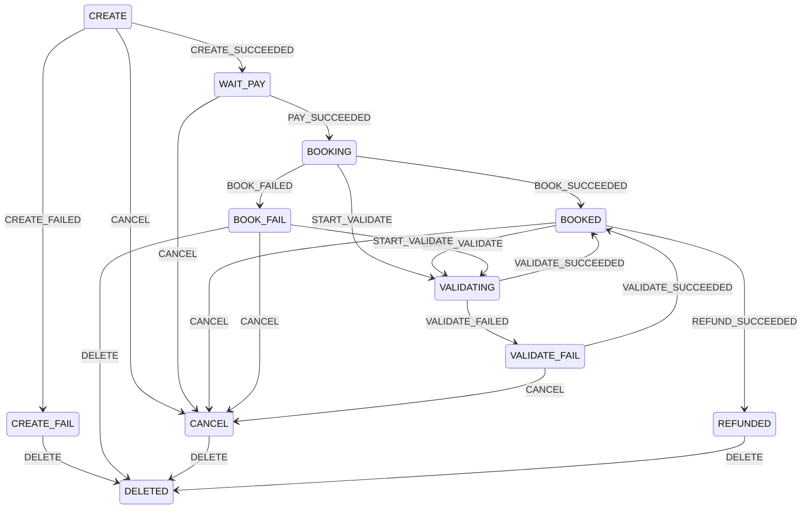

# 架构方案伪代码库

`architecture` module 用于沉淀不同业务场景下的架构思路、设计方案和关键伪代码。它关注的是
复杂问题如何拆分、核心流程如何协作、数据一致性如何保证，以及不同技术组件之间的边界，而不是提供
可以直接上线的完整业务系统。

当前实现以机票业务为背景，模拟以下两个相互关联的架构场景：

1. **多供应商并发搜索**：一次机票查询并发分发给多个供应商，通过异步回调聚合结果，并支持超时返回部分结果。
2. **海量政策高性能匹配**：使用 RocksDB 保存政策明细、RoaringBitmap 构建匹配索引，并通过版本化快照实现运行时无损切换。

后续会继续增加交易、下单等其他场景的架构伪代码，使该 module 逐步形成可复用的架构与设计方案集合。

## 模块目标

- 用最少的代码表达架构中的核心职责、协作关系和一致性约束。
- 为类似业务问题提供可讨论、可验证、可演进的设计参考。
- 通过接口隔离外部系统，使方案不被 Dubbo、Kafka、Redis 等具体技术绑定。
- 通过测试验证关键架构行为，而不是覆盖完整的生产业务流程。
- 持续积累搜索、政策匹配、交易、下单等不同场景的方案。

本模块属于架构伪代码，生产落地时仍需根据实际情况补充鉴权、限流、熔断、监控、链路追踪、异常分级、
数据迁移、容量评估、容灾和部署方案。

## 场景目录

| 场景 | 核心问题 | 当前状态 |
| --- | --- | --- |
| 多供应商并发搜索 | 任务分发、异步回调、结果聚合、超时与迟到回调 | 已实现伪代码 |
| 海量政策匹配 | 全量加载、增量追平、位图索引、快照校验与热切换 | 已实现伪代码 |
| 交易/下单 | 幂等下单、受控状态流转、乐观并发与失败隔离 | 已实现核心伪代码 |

## 分层结构

代码先区分项目级公开契约、公共能力和具体业务场景，再在场景内部按照应用、领域和基础设施分层。

```text
com.arch.policy
├── api
│   ├── book                   # 下单及订单状态变更契约
│   └── search                 # 项目级搜索契约、请求和响应 DTO
├── common
│   ├── config                 # Spring Bean 装配
│   └── model                  # 可跨场景复用的模型
├── search
│   ├── application            # 查询编排、回调处理、启动和增量更新用例
│   ├── domain
│   │   └── snapshot           # RocksDB/位图快照领域逻辑
│   └── infrastructure
│       ├── demo               # 模拟供应商
│       ├── kafka              # 政策变更消息适配器
│       ├── redis              # 聚合状态和完成通知适配器
│       └── rpc                # Dubbo 接口实现
├── book
│   ├── application            # 幂等下单、状态变更用例和持久化端口
│   ├── domain                 # 订单聚合、状态枚举和合法迁移规则
│   └── infrastructure         # 内存仓储示例和 Dubbo 适配器
└── PolicySearchApplication    # 当前搜索场景的启动入口
```

依赖方向如下：



公开 API 不依赖场景内部实现，领域层不依赖 Dubbo、Redis、Kafka 等外部技术。后续增加交易场景时，
可以平行新增 `api.order` 和 `order.application/domain/infrastructure`，避免交易代码与搜索代码混杂。
只有真正跨场景稳定复用的模型或能力才应放入 `common`。

## 场景一：多供应商并发搜索

查询服务将一次请求分发给多个供应商。供应商可以分批回调结果，最后一次回调负责声明该供应商完成。
Redis 保存聚合结果、待完成供应商集合和查询状态，是整个流程的唯一事实来源。



本地等待器和 Redis Pub/Sub 只用于提前唤醒。即使通知丢失，查询线程仍会定期检查 Redis。超过总超时时间后，
Lua 脚本会原子地将查询状态更新为 `TIMED_OUT`，返回已经收到的部分结果，并拒绝迟到回调继续修改结果。

## 场景二：海量政策匹配与快照切换

每个政策快照使用独立目录保存 RocksDB 明细库，并在内存中维护 RoaringBitmap 匹配索引。新版本先在旁路
完成全量加载、增量追平和一致性校验，只有通过校验后才会替换当前服务版本。



查询通过 `ActiveSnapshotRegistry.acquire()` 获取快照租约，并使用 `try-with-resources` 释放。切换完成后，
新查询立即使用新快照，旧快照则保留到最后一个旧查询结束，从而避免正在执行的查询访问已关闭的 RocksDB。

快照方案的主要扩展点：

1. `FullPolicyLoader`：加载全量政策，并返回全量数据对应的消息位置。
2. `IncrementalReplayer`：回放全量切点之后的新增、修改和删除事件。
3. `SnapshotValidator`：校验政策明细、位图索引和消息位置的一致性。
4. `SnapshotDirectory`：隔离不同快照版本的存储目录。
5. `PolicySnapshotService`：负责首次初始化、失败重试和运行时刷新。

Kafka 政策变更消息使用全局单调递增的 `position`，重复或乱序消息会被忽略。如果 Topic 使用多个分区，
生产端必须提供全局序列；否则应将当前位置模型调整为按分区保存 offset。

## 场景三：幂等下单与订单状态机

`BookOrderRpcService.createOrder` 以调用方生成的 `requestId` 作为幂等键。订单通过 `CREATE_SUCCEEDED` 事件
从 `CREATE` 进入 `WAIT_PAY`。重复请求返回第一次创建的订单，不重复生成业务单。生产实现应在数据库中为
`request_id` 建唯一索引，并把创单与初始状态流转放入本地事务。

外部系统通过 `BookOrderRpcService.fireEvent` 提交支付、出票、验真、取消等业务事件，不能直接指定目标状态。
`OrderStateMachine` 使用 `(当前状态, 业务事件)` 定位唯一迁移，状态参考 `ipolicytradecore`：



一次迁移依次执行 Guard、前置 Action、领域状态变更、原子持久化和后置 Action。`PAY_SUCCEEDED`、
`BOOK_SUCCEEDED` 等关键事件通过 Guard 校验支付单号、PNR 等业务凭据；业务可以通过迁移 Builder 注册更多
风控校验、库存检查和任务创建处理器，而不修改状态机引擎。

状态事件携带全局唯一 `eventId` 和 `expectedVersion`。仓储在一个事务边界内完成以下写入：

1. 使用 `order_no + version` compare-and-set 更新订单，阻止并发覆盖。
2. 保存 `eventId` 处理结果，重复消息直接返回第一次处理的快照。
3. 追加包含 `from/event/to/operator` 的完整状态历史。
4. 写入 Outbox 消息，由独立发布任务可靠投递给库存、支付、出票等下游。

后置 Action 仅在事务提交后执行，失败会进入 `FailedPostActionStore` 等待重试，不会把已提交订单回滚成旧状态。
示例使用内存实现展示原子语义；生产落地应使用数据库唯一索引、条件更新、状态历史表、Outbox 表和重试任务，
并由消息消费方继续按照 `eventId` 幂等。

## 新增架构场景的约定

新增交易、下单或其他架构伪代码时，应遵循以下约定：

1. 在 README 的场景目录中说明要解决的问题、关键约束和方案状态。
2. 对外契约放在 `api.<scene>`，内部实现放在对应的 `<scene>` 业务包。
3. 使用 `application/domain/infrastructure` 表达职责边界，不让领域规则依赖具体中间件。
4. 优先提供展示关键协作关系的最小实现，避免把伪代码扩展成不完整的生产框架。
5. 为幂等、一致性、并发、超时、切换和失败隔离等关键架构行为编写测试。
6. 在场景文档中记录设计取舍、适用边界，以及生产落地仍需补充的能力。

## 运行验证

在仓库根目录执行：

```bash
mvn -f architecture/pom.xml clean test
```

当前测试覆盖异步供应商聚合、超时返回部分结果、全量加增量快照构建、运行时快照切换、幂等下单、事件驱动
状态迁移、Guard/Action 执行顺序、事件幂等、乐观并发、状态历史和 Outbox 原子记录。
